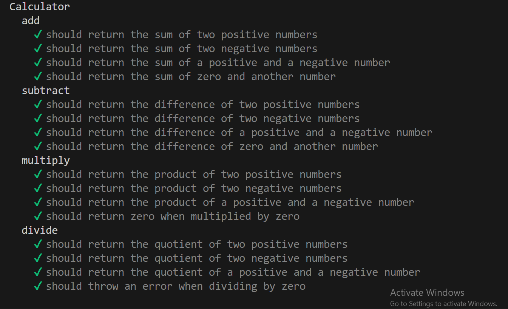

Step by step explanations are givin here:-

1. firstly  create a folder by mkdir command and put these two files into it .
2. npm init -y (which create package.json file which having all the dependencies and meta data about this testing project)
3. npm install --save-dev mocha chai (installing latest version of mocha tools and create a node modules folder)
4. write the tests.mjs cases 
5. open package.json file and change scripts of test with this ("test": "mocha tests.mjs").
6. execute command            npm test
7. results -- 16 passing tests.

NOTE:- to execute this test in another devices first execute command npm install and than npm test